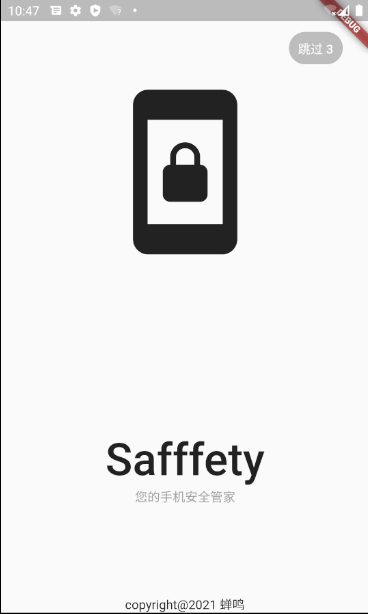
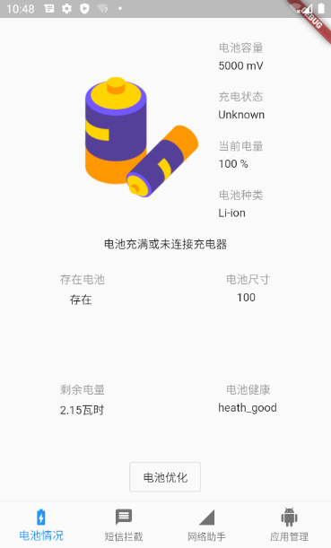
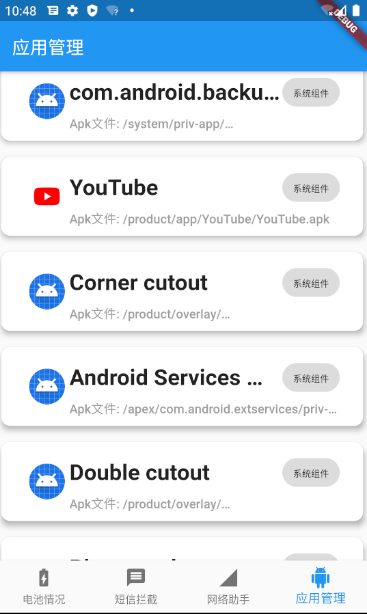
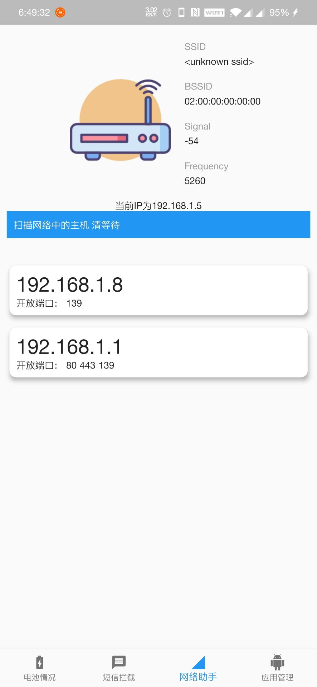

# safffety

An App makes andriod more safety

## 简介

为了熟练掌握Flutter框架和Dart语言，这是学习Flutter之后的第二个Demo，本软件包括四个模块，电池管理、应用管理、网络管理、短信拦截

### 电池管理

电池管理模块可告知用户电池健康状况信息、电池充电状态和预估充电时间/毫安时/电池预估使用时长、电池使用技术等信息

### 应用管理

列出所有应用(包括系统应用)和其图标和类别，方便用户管理应用，可管理应用权限/卸载等操作(调用系统自带实现)

### 网络管理

此功能会探查连接的Wifi状态等信息，并自动扫描同一网段内常用端口的开放情况，并列出所有存活主机

### 短信拦截

自动分析短信是否为垃圾短信/广告/诈骗短信，从而标注并提示用户(暂未完全实现)

## 部分截图

